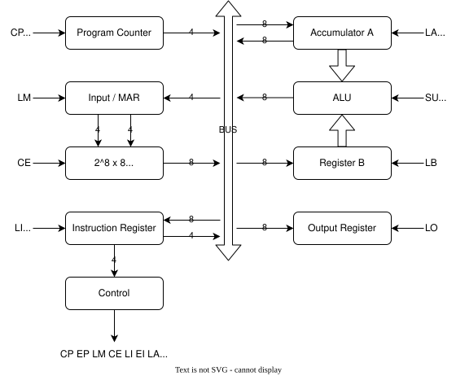

# lil_cpu
Yet another small VHDL CPU design. The goals of this project are to:
- remind myself about CPU architecture.
- experiment with open source tools.
- have a bit of fun.

# Design
The project was inspired by [Ben Eater's 8-bit computer](https://eater.net/8bit), which I built on breadboards many years ago. Ben's design is a variant of the ["Simple-As-Possible"](https://handwiki.org/wiki/Simple-As-Possible#cite_note-1) computer from the book Digital Computer Electronics by Albert Paul Malvino and Jerald A. Brown. I'll start off by building SAP-1.

## Memory
The SAP design uses only a 16-address RAM. We have an 8-bit address, so we'll be using 2^8 addresses.

## Control Signal Polarity
The SAP design uses some active-low control signals, likely due to the discrete components used in the design. To simplify things, we wil only use active-high control signals.

## Negative clock Edges
The SAP design uses the _falling_ edge of the clock to increment the program counter. FPGA registers do not act on falling clock edges. Our design will by totally synchronous to the rising edge of the clock.

## Bus
The SAP design connects everything via a single bus. This is great for simplicity, and great for a circuit with discrete logic where we can install tr-state buffers, but high-impedance is not supported by FPGA logic, which would be the target of this project if we were to go to hardware. I will start off by connecting everything to a bus for simplicity, and then move to discrete connections.

# Tasks
For each module, I'd like to do the following tasks.
[ ] Design - Ideally a diagram and some documentation before I start writing any code.
[ ] Implementation - The design coded up in VHDL.
[ ] Verification - A self-checking testbench to validate the operation of the module.

# Stretch Goals
- implement the [LC-3](https://en.wikipedia.org/wiki/Little_Computer_3) ISA.
- implement a compiler from assembly to machine code.
