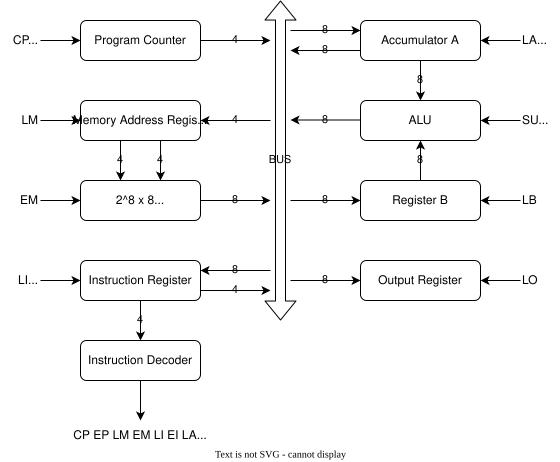

# lil_cpu
Yet another small VHDL CPU design. The goals of this project are to:
- remind myself about CPU architecture.
- experiment with open source tools.
- have a bit of fun.

# Design
The project was inspired by [Ben Eater's 8-bit computer](https://eater.net/8bit), which I built on breadboards many years ago. Ben's design is a variant of the ["Simple-As-Possible"](https://en.wikipedia.org/wiki/Simple-As-Possible_computer) computer from the book Digital Computer Electronics by Albert Paul Malvino and Jerald A. Brown. I'll start off by building SAP-1.

SAP-1's design is broken down into modules, as shown below:

## Control Signals

The control signals in the diagram are labelled with two letters. The first letter in the name denotes the type of operation being performed, as defined in the table below.
| Symbol | Control Signal |
|---|---|
| E | Enable output to the bus |
| L | Load from the bus |
| C | Count (i.e. Increment) (Program Counter only) |
| S | Subtract rather than add (ALU only) |

The second letter, in subscript, in each signal name denotes the module that the signal applies to, e.g P for Program Counter. The mapping between letters and modules is hopefully self-evident from the diagram.

## Instruction Set

The control signals are used to form high-level instructions, as defined in the table below.
| Instruction | Operation | Opcode (hex) |
|---|---|---|
| LDA | Load RAM data to Register A | 0x0 |
| ADD | Add RAM data to Register A | 0x1 |
| SUB | Subtract RAM data from Register A | 0x2 |
| LOR | Load Register A data into the Output Register | 0xE |
| HLT | Stop Processing | 0xF |

Note that `LOR` is usually called `OUT`. I've had to give it a different name as `OUT` is a reserved word in VHDL.

## Deviations
This design will not follow the SAP-1 design exactly. The following changes have been made.

### Microinstruction Optimisation
The original microinstructions separate the program counter increment and the loading of the opcode into the instruction register into two separate steps. These are independent operations and we'll combine them into one step for efficiency.

### Ring Counter
Rather than a one-hot ring counter, we're using a regular binary counter for simplicity.

### Control Signal Polarity
The SAP design uses some active-low control signals, likely due to the discrete components used in the design. To simplify things, we wil only use active-high control signals.

### Negative clock Edges
The SAP design uses the _falling_ edge of the clock to increment the program counter. FPGA registers do not act on falling clock edges. Our design will by totally synchronous to the rising edge of the clock.

### Bus
The SAP design connects everything via a single bus. This is great for simplicity, and great for a circuit with discrete logic where we can install tr-state buffers, but high-impedance is not supported by FPGA logic, which would be the target of this project if we were to go to hardware. I will start off by connecting everything to a bus for simplicity, and then move to discrete connections in the next phase.

# Tasks
For each module, I'd like to do the following tasks:
- [ ] Design - Ideally a diagram and some documentation before I start writing any code.
- [ ] Implementation - The design coded up in VHDL.
- [ ] Verification - A self-checking testbench to validate the operation of the module.

# Stretch Goals
- Run the CPU on real hardware (maybe [FOMU](https://www.crowdsupply.com/sutajio-kosagi/fomu) or [iCEBreaker](https://1bitsquared.com/products/icebreaker).
- Implement the [LC-3](https://en.wikipedia.org/wiki/Little_Computer_3) ISA.
- Implement a compiler from assembly to machine code.
